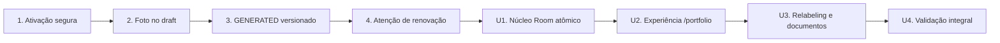

# Plano técnico integrado — unificação de prédios e quartos

Este plano transforma `docs/plano-unificacao-predios-quartos.md` em uma sequência executável e incorpora os achados da \[\[revisao-implementacao-mvp-ipad\]\] sem misturar as duas frentes.

## Sequência aprovada

Os quatro fixups do MVP vinculados a \[\[revisao-implementacao-mvp-ipad\]\] são entregues primeiro, na ordem já priorizada. A unificação começa somente com essa base verde. OpenAPI, cliente gerado e arquivos compartilhados são atualizados sequencialmente; não há execução paralela entre essas etapas.

## Decisões de produto confirmadas

| Tema                  | Decisão                                                                                  |
| --------------------- | ---------------------------------------------------------------------------------------- |
| Conceito locável      | `Room`/quarto substitui integralmente imóvel/unidade e sempre pertence a um prédio       |
| Descrição documental  | `Quarto {número} — {nome do prédio}, {bairro}`; endereço não participa porque é opcional |
| Seleção no onboarding | Data + prédio opcional + busca textual; listar apenas quartos vagos                      |
| Dashboard             | `byProperty` vira `byRoom`; agrupamento de unidades sem prédio é removido                |
| Ordem                 | Fixups 1→4 antes da unificação U1→U4                                                     |

## Decisões técnicas

### Corte atômico do núcleo

U1 substitui banco, domínio, API e consumidores frontend no mesmo ticket. Não haverá alias temporário de `/properties`, DTOs duplicados ou campos legados: isso preserva a premissa de ausência de consumidores externos e evita criar uma camada descartável de compatibilidade. A implementação pode usar commits internos ordenados, mas o ticket só fica pronto quando o contrato novo estiver íntegro de ponta a ponta.

### Banco e reset deliberado

- Criar migration manual posterior ao histórico atual, substituindo `property_units` por `rooms` e renomeando referências, FKs, índices e a exclusão GiST de contratos.
- `rooms.building_id` e `rooms.number` são obrigatórios; a unicidade do número é case-insensitive e limitada ao prédio.
- Remover o enum e as colunas de tipo/bairro da unidade; endereço e bairro vêm de `buildings`.
- O runbook exige confirmação explícita antes de recriar volumes PostgreSQL e MinIO. O reset nunca será acionado silenciosamente por migration ou bootstrap.
- Validar migrations completas em banco vazio e o ciclo da última migration `run → revert → run`.

### Contratos de API e disponibilidade

- Remover `/properties` e expor `GET/POST /rooms` e `GET/PATCH /rooms/:id`.
- `GET /rooms` aceita `q`, `buildingId`, `status`, `date` e paginação. A busca cobre número do quarto e nome, bairro ou endereço do prédio.
- Expandir `/buildings` com data, vacância, busca e métricas de quartos.
- Calcular ocupação por data civil em `America/Sao_Paulo`, considerando contratos vigentes e ignorando cancelados/encerrados.
- Regenerar snapshot OpenAPI e cliente TypeScript no mesmo corte.

### Contextos transversais

- Renomear `propertyUnitId/propertyUnit` para `roomId/room` em contratos, onboarding, recibos, dashboard, auditoria, CSVs e payloads.
- Drafts e documentos atuais são descartados pelo reset; não haverá backfill nem compatibilidade do payload v1 antigo.
- Centralizar a construção da descrição documental. O fixup de `GENERATED` prepara o ponto único; U3 troca o formato para a descrição canônica aprovada e o aplica a prévia, versão armazenada e recibo.
- A ativação por primeira fatura `PAID`, a foto temporária do draft e `renewalAttention` não mudam semanticamente durante a unificação.

## Matriz de impacto nos fixups

| Fixup                      | Impacto da unificação            | Tratamento                                                                   |
| -------------------------- | -------------------------------- | ---------------------------------------------------------------------------- |
| Ativação até fatura `PAID` | Nenhum semântico                 | Preservar regra e ordem de locks `invoice → contract`                        |
| Foto no draft              | Apenas rename vizinho no payload | Manter coluna/storage próprios; adaptar `propertyUnitId` para `roomId` em U1 |
| Documento `GENERATED`      | Formato da descrição muda        | Centralizar descrição no fixup; aplicar formato canônico em U3               |
| Atenção de renovação       | Nenhum semântico                 | Preservar `renewalAttention`; adaptar apenas nomes vizinhos                  |

## Entregas

- \[\[nucleo-atomico-room\]\] — banco, domínio, APIs e adaptação mínima de consumidores.
- \[\[experiencia-portfolio\]\] — navegação e gestão unificada em `/portfolio`.
- \[\[relabeling-documentos-dashboard\]\] — linguagem transversal, dashboard e descrições documentais.
- \[\[validacao-integral\]\] — E2E, matriz iPad, migrations e containers.

## Riscos controlados

| Risco                                          | Controle                                                                                     |
| ---------------------------------------------- | -------------------------------------------------------------------------------------------- |
| U1 amplo e breaking                            | Um único contrato novo, commits internos verificáveis e gates completos antes do merge       |
| Conflitos em OpenAPI/cliente                   | Execução estritamente sequencial                                                             |
| Perda acidental de dados locais                | Runbook explícito e confirmação humana antes do reset                                        |
| Regressão da exclusão de contratos sobrepostos | Recriar GiST sobre `room_id` e cobrir concorrência/disponibilidade                           |
| Descrições divergentes entre PDF e recibo      | Um único construtor de descrição documental                                                  |
| Código legado residual                         | Busca final por `PropertyUnit`, `property_unit`, `/properties`, `UnitType` e rótulos antigos |

## Fonte de verdade

- `docs/plano-unificacao-predios-quartos.md` governa o comportamento de produto.
- Este artefato governa sequência, fronteiras técnicas e integração com os quatro fixups.
- \[\[revisao-implementacao-mvp-ipad\]\] preserva a evidência original dos achados.